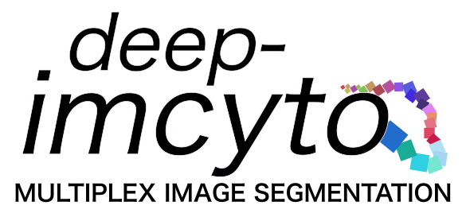
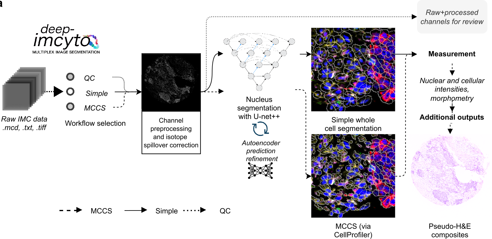
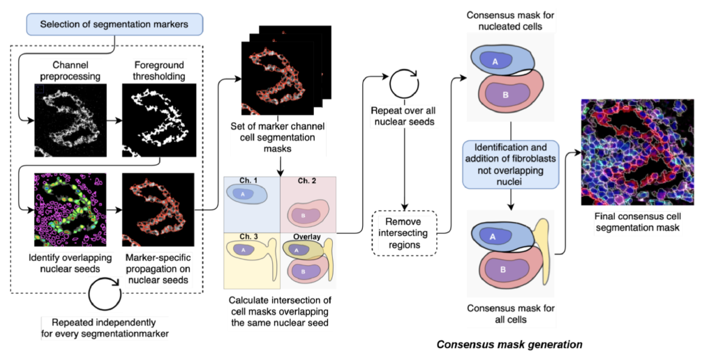

# 

[](https://github.com/nf-core/imcyto/actions)
[](https://github.com/nf-core/imcyto/actions)
[](https://www.nextflow.io/)
[](https://doi.org/10.5281/zenodo.3865430)

## Introduction

**deep-imcyto** is a bioinformatics analysis pipeline for segmentation and other principal tasks in imaging mass cytometry data analysis. It is an update and extension of **nfcore/imcyto**, a bioinformatics analysis pipeline developed by van Maldegem et al. for IMC image segmentation and extraction of single cell expression data. **deep-imcyto** provides highly accurate cell segmentation of IMC images based on a U-net++ deep learning model as well as facilities for QC and manual review of image processing steps, which can be invaluable during IMC experimental design. 

deep-imcyto is implemented in [Nextflow](https://www.nextflow.io), a workflow tool to run tasks across multiple compute infrastructures in a very portable manner. It comes with docker containers making installation trivial and results highly reproducible.

**deep-imcyto** is a consitutent component of the [TRACERx-PHLEX](https://github.com/FrancisCrickInstitute/TRACERx-PHLEX) pipeline for highly multiplexed imaging. Other components include TYPEx, for detailed cell phenotyping and Spatial-PHLEX for single cell spatial data analysis.

## Pipeline summary

deep-imcyto has three modes of operation: `QC`, `Simple segmentation` and `Multiplexed Consensus Cell Segmentation`, summarised in the diagram below.

# 


# QC mode

deep-imcyto's QC mode is designed to provide quick access to individual channels in IMC data for quality control and/or review by splitting .mcd files into constituent channel images by imaged ROI. If a particular preprocessing option is selected (e.g. `spillover correction`, `hotpixel removal` or the application of a custom set of preprocessing steps specified as a CellProfiler `.cppipe` file) then this preprocessing will be performed, as produced as an output of the QC run for manual review.

# Segmentation modes

1. **Simple**
    
    In `simple` segmentation mode an approximation of whole cell segmentation is performed where accurate predicted nuclei are dilated by a user-defined number of pixels.

2. **Multiplexed consensus cell segmentation (MCCS)**
    
    In `MCCS` mode a more accurate whole cell segmentation is performed following the multiplexed consensus cell segmentation principles using nuclear predictions and progressive masking of specific marker channels (See [LINK TO PAPER] and [LINK TO READTHEDOCS]). MCCS procedures are provided to deep-imcyto as a CellProfiler pipeline which is then executed in as parallel way as possible via Nextflow.

# 


<!-- ## Quick Start

deep-imcyto is designed with HPC systems in mind due to the high processing requirements of large scale IMC cohorts. However it may be run outside of this context, provided the user has access to a CUDA-enabled GPU. To run deep-imcyto on your system with the test data, perform the following:

i. Install [`nextflow`](https://nf-co.re/usage/installation)

ii. Install one of [`docker`](https://docs.docker.com/engine/installation/) or [`singularity`](https://www.sylabs.io/guides/3.0/user-guide/)

iii. Download the pipeline and test it on a minimal dataset with a single command

```bash
nextflow run nf-core/imcyto -profile test,<docker/singularity/institute>
```

> Please check [nf-core/configs](https://github.com/nf-core/configs#documentation) to see if a custom config file to run nf-core pipelines already exists for your Institute. If so, you can simply use `-profile <institute>` in your command. This will enable either `docker` or `singularity` and set the appropriate execution settings for your local compute environment.

iv. Start running your own analysis! -->

## Running deep-imcyto on an HPC system running SLURM


1. Clone the deep-imcyto repository.

2. Download both the deep-imcyto trained nucleus model weights and the example test dataset from our Zenodo repository (https://doi.org/10.5281/zenodo.7573269)

3. Unzip these `.zip` archives to an appropriate location respectively (total space required ~1GB)

4. Ensure your HPC system has `Nextflow/22.04.0` and `Singularity/3.6.4` installed.

5. Set your profile (see below)

6. Edit the following script appropriately and run it from a compute node.

> This will run deep-imcyto in `simple` segmentation mode.

```bash
#!/bin/bash

## LOAD MODULES
ml purge
ml Nextflow/22.04.0
ml Singularity/3.6.4

# Define a folder on your system for the deep-imcyto software containers to be stored (space required ~10GB):
export NXF_SINGULARITY_CACHEDIR='/path/to/containers/deep-imcyto'


# RUN DEEP-IMCYTO:
nextflow run ./main.nf\
    --input "/path/to/test/dataset/*/*/*.tiff"\
    --outdir '../results/simple'\
    --metadata 'assets/metadata/PHLEX_simple_segmentation_metadata_p1.csv'\
    --email your_email@your_institute.ac.uk\
    --nuclear_weights_directory "/path/to/weights/directory"\
    --segmentation_workflow 'simple'\
    --nuclear_dilation_radius 5\
    --preprocess_method 'hotpixel'\
    --n_neighbours 5\
    --singularity_bind_path '/camp'\
    -w '/path/to/work/directory/'\
    -profile <docker/singularity/institute>
```
To run deep-imcyto in `MCCS` mode, run the following:

```bash
#!/bin/bash

## LOAD MODULES
ml purge
ml Nextflow/22.04.0
ml Singularity/3.6.4

# Define a folder on your system for the deep-imcyto software containers to be stored (space required ~10GB):
export NXF_SINGULARITY_CACHEDIR='/path/to/containers/deep-imcyto'


# RUN DEEP-IMCYTO:
nextflow run ./main.nf\
    --input "/path/to/test/dataset/*/*/*.tiff"\
    --outdir '../results/MCCS'\
    --metadata 'assets/metadata/PHLEX_simple_segmentation_metadata_p1.csv'\
    --email alastair.magness@crick.ac.uk\
    --nuclear_weights_directory "/path/to/weights/directory"\
    --segmentation_workflow 'MCCS'\
    --full_stack_cppipe './assets/cppipes/full_stack_preprocessing.cppipe'\
    --segmentation_cppipe './assets/cppipes/segmentationP1.cppipe'\
    --mccs_stack_cppipe './assets/cppipes/mccs_stack_preprocessing.cppipe'\
    --compensation_tiff './assets/spillover/P1_imc*.tiff'\
    --plugins "./assets/plugins"\
    --singularity_bind_path '/camp'\
    -w '/path/to/work/directory/'\
    -profile <docker/singularity/institute>
```

The variable `singularity_bind_path` tells deep-imcyto how to bind paths inside and outside the deep-imcyto Docker/Singularity container. If it is not explicitely set deep-imcyto attempts to use the root of the absolute path to the deepimcyto repository base directory [i.e. `/path` in `/path/to/deep-imcyto`].

See [usage docs](docs/usage.md) for all of the available options when running the pipeline.

## Container
deep-imcyto runs inside a customised Docker container built on top of the [rapids-22.02-cuda11.0-base-ubuntu18.04-py3.8](https://hub.docker.com/r/rapidsai/rapidsai/) Docker container for reproducible GPU-accelerated data science. Important prerequisites for the RAPIDS are as follows:

- NVIDIA Pascal™ GPU architecture or better
- CUDA 11.2/11.4/11.5 with a compatible NVIDIA driver
- nvidia-container-toolkit

See [RAPIDS](https://hub.docker.com/r/rapidsai/rapidsai/) for more information.

## Documentation

The nf-core/imcyto pipeline comes with documentation about the pipeline, found in the `docs/` directory:

1. [Installation](https://nf-co.re/usage/installation)
2. Pipeline configuration
    * [Local installation](https://nf-co.re/usage/local_installation)
    * [Adding your own system config](https://nf-co.re/usage/adding_own_config)
3. [Running the pipeline](docs/usage.md)
4. [Output and how to interpret the results](docs/output.md)
5. [Troubleshooting](https://nf-co.re/usage/troubleshooting)

## Credits

deep-imcyto is primarily developed by [Alastair Magness](mailto:alastair.magness@crick.ac.uk) at [The Francis Crick Institute](https://www.crick.ac.uk). Other core contributors include [Emma Colliver](mailto:emma.colliver@crick.ac.uk), [Mihaela Angelova](mailto:mihaela.angelova@crick.ac.uk), and [Katey Enfield](katey.enfield@crick.ac.uk).

nf-core/imcyto was originally written by [The Bioinformatics & Biostatistics Group](https://www.crick.ac.uk/research/science-technology-platforms/bioinformatics-and-biostatistics/) for use at [The Francis Crick Institute](https://www.crick.ac.uk/), London. It was developed by [Harshil Patel](mailto:harshil.patel@crick.ac.uk) and [Nourdine Bah](mailto:nourdine.bah@crick.ac.uk) in collaboration with [Karishma Valand](mailto:karishma.valand@crick.ac.uk), [Febe van Maldegem](mailto:febe.vanmaldegem@crick.ac.uk) among others.


It would not have been possible to develop this pipeline without the guidelines, scripts and plugins provided by the [Bodenmiller Lab](http://www.bodenmillerlab.com/). Thank you too!

## Contributions and Support

If you would like to contribute to this pipeline, please see the [contributing guidelines](.github/CONTRIBUTING.md).

For further information or help, don't hesitate to get in touch on [Slack](https://nfcore.slack.com/channels/imcyto) (you can join with [this invite](https://nf-co.re/join/slack)).

## Citation


You can cite the `nf-core` publication as follows:

> **The nf-core framework for community-curated bioinformatics pipelines.**
>
> Philip Ewels, Alexander Peltzer, Sven Fillinger, Harshil Patel, Johannes Alneberg, Andreas Wilm, Maxime Ulysse Garcia, Paolo Di Tommaso & Sven Nahnsen.
>
> _Nat Biotechnol._ 2020 Feb 13. doi: [10.1038/s41587-020-0439-x](https://dx.doi.org/10.1038/s41587-020-0439-x).  
> ReadCube: [Full Access Link](https://rdcu.be/b1GjZ)

An extensive list of references for the tools used by the pipeline can be found in the [`CITATIONS.md`](CITATIONS.md) file.
